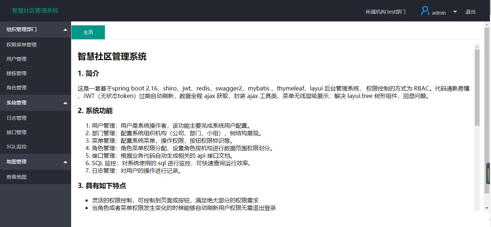
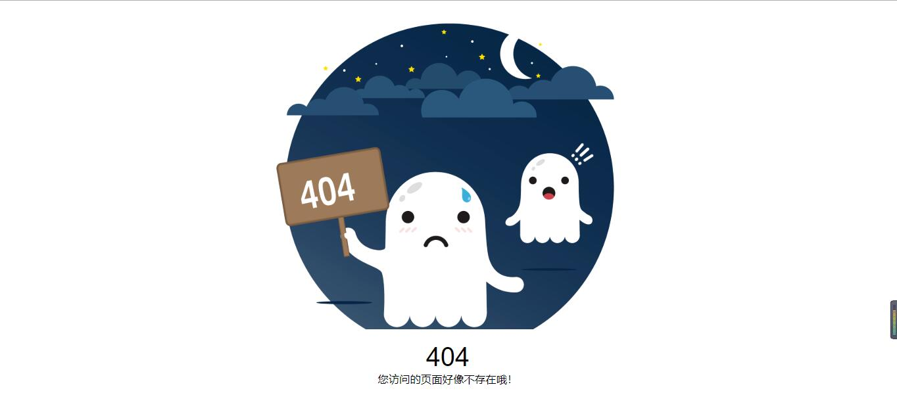

# 一、项目简介
该系统是一个 `企业级前后端分离后端管理系统`。

技术栈主要使用`thymeleaf、 layUI、 jQuery、 axios、 spring boot、 shiro、 redis、 jwt、 mybatis、 mysql、 阿里云centos系统` 等等。  

项目开发模式采用前后端分离， 采用前后端分离，内置了许多管理系统常用功能，通过一些脚本、封装帮助开发人员快速开发管理系统，集中精力处理业务逻辑。

感谢开源社区，感谢各种技术栈团队提供优秀的开源项目！

# 二、文档开发流程
项目的开发路线(流程) 在docs目录下的 description.md 文档

# 三、 系统功能
1. 用户管理：用户是系统操作者，该功能主要完成系统用户配置。
2. 部门管理：配置系统组织机构（公司、部门、小组），树结构展现。
3. 菜单管理：配置系统菜单，操作权限，按钮权限标识等。
4. 角色管理：角色菜单权限分配、设置角色按机构进行数据范围权限划分。
5. 接口管理：根据业务代码自动生成相关的 api 接口文档。
6. SQL 监控：对系统使用的 sql 进行监控，可快速查询运行效率。
7. 日志管理：对用户的操作进行记录。
8. 地图管理： 使用百度地图api, 展示地图。

# 四、项目预览
预览地址[http://123.56.30.106:8080/index/login](http://123.56.30.106:8080/index/login)  
用户名： admin  
密码： 666666  
请勿在数据进行删除(可以进行添加)

# 五、项目截图
这里只提供了部分页面截图，根据文档快速开始进行项目的搭建，浏览项目丰富功能！

## 1. 登录页面


## 2. 首页


## 3. 500页面


## 4. 404页面


# 六、项目结构
```
docs                        // 开发文档
 -image-storage             // 图片
 -company_frame.sql         // 项目底层SQL
src
 -main
  -java
   -com.feng.companyframe   // 项目包
    -aop                    // aop 包
    -bean                   // 实体类
    -config                 // 公共配置类
    -constant               // 静态类
    -controller             // 控制层
    -exception              // 异常类
    -jwt                    // jwt 类
    -mapper                 // mybatis 底层 接口
    -serializer             // 自定义 序列化类
    -services               // 服务层
    -shiro                  // shiro 配置类
    -test                   // 测试类
    -utils                  // 封装的工具类
    -vo                     // 前后端交互的请求参数
   -resources
    -mapper                 // mybatis 底层的SQL
    -static                 // 静态资源文件
    -templates              // 前端页面
    -application.yml        // 页面配置文件
    -generatorConfig.xml    // mybatis 逆向生成配置文件
```